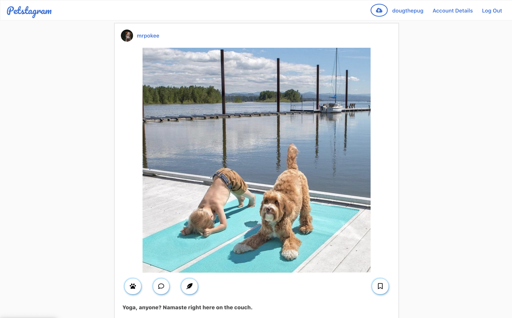
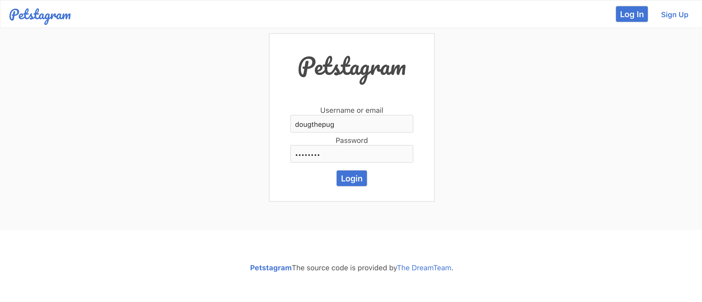

# Petstagram

## Description

A fun spin on Instagram where the animals are the users.

## Features MVP
- [x] User Auth
- [x] Images
- [x] Likes
- [x] Commenting on Images
- [x] Following & Photo feed

## Stretch Goals
- Direct Messaging
- hashtags

## Database
- https://drawsql.app/appacademy-2/diagrams/petstagram#

## Overall Structure

### Front End
We used React and JavaScript on the front end. Using React hooks let us utilize state and context to keep our app from having to refresh.

### Back End
We used Python's Flask framework on our back end. We used the following endpoints to make our app RESTful

1. Main:
    - GET / - All posts from accounts user follows

2. Blueprint: 'users', url_prefix = "/api/users"
    - GET /:id - Get all user info
    - POST / - Create new user
    - PUT /:id - Edit user info
    - DELETE /:id - Delete user

3. Blueprint: 'posts', url_prefix = "/api/posts"
    - GET /:id - Get one post
    - POST / - Create a new post
    - PUT /:id - Edit a post
    - DELETE /:id - Delete a post

4. Blueprint: 'comments', url_prefix = "/api/comments"
    - GET /:id - Get all comments for post at id
    - POST /:id - Comment on a post at id
    - DELETE /:id/:id2 - Delete comment(id2) from post at id

5. Blueprint: 'likes', url_prefix = "/api/likes"
    - GET /:id - Get all likes for post at id
    - POST /:id - Like a post at id
    - DELETE /:id - Unlike post at id

8. Blueprint: 'following', url_prefix = "api/following"
    - GET / - All accounts the user is following
    - POST / - Follow someone
    - DELETE / - unfollow someone

9. Blueprint: 'followers', url_prefix = "api/followers"
    - GET /:id - Get all followers for user

### Libraries
* React.js
* Flask
* Flask-Cors
* Flask-SQLAlchemy
* SQLAlchemy
* Werkzeug
* Alembic
* Flask-Migrate
* Flask-Login

## Primary Components

### User Authorization
We used Flask-Login on our back end to keep track of our user authorization. On the front end, we used protected routes to re-route to the log-in/ sign-up page. 

### Profile Page
Keeping track of our users and state we were able to render a users profile with all of their posts.

