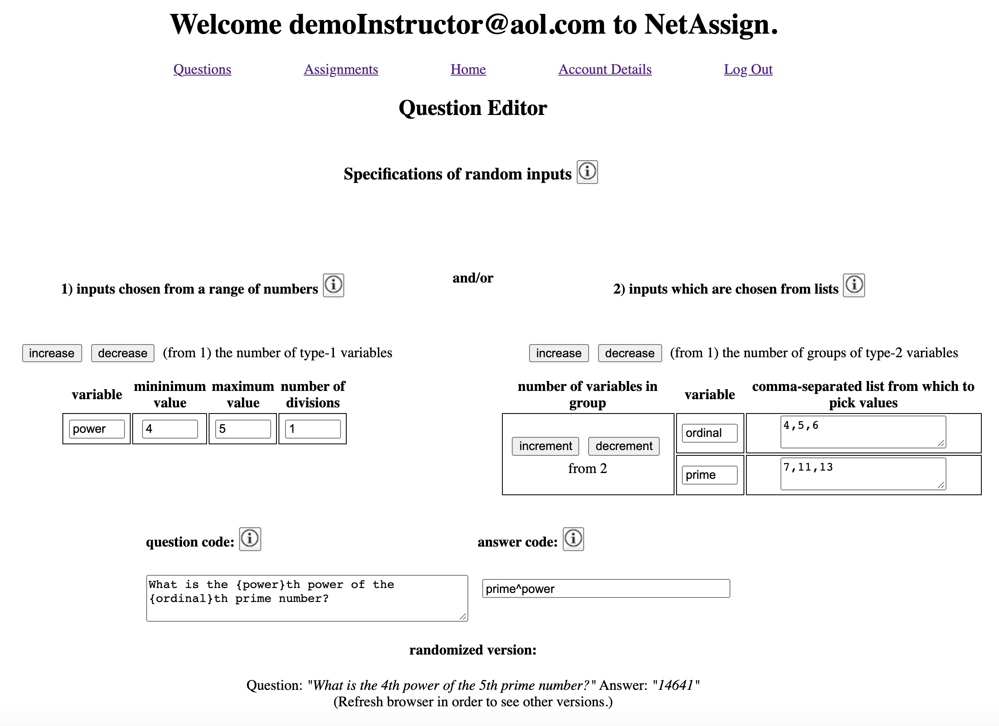

# Contents

[schema](https://drawsql.app/appacademy-2/diagrams/net-assign)

[Heroku deployment](https://net-assign.herokuapp.com)

[Introduction](#introduction)

[Instructor/student dichotomy](#instructor/student-dichotomy)

[Question Editor](#question-editor)

[Joins tables](): enrollments (users, courses), appearances (questions, assignments), deployments (courses, assignments, but can be multiple), submissions (deployments, users)

[Duplication of resources]()
CRUD + Duplicate (POST w/included ID#)

[Gradebook]() IN PROGRESS

# Introduction

[return to "Contents"](#contents)

[go to next section ("Instructor/student dichotomy")](#instructor/student-dichotomy)

This app is a clone of [WebAssign](http://www.webassign.net), a leader in the delivery, administration, and automated grading of online assignments to students in high school and college.  My close uses JavaScript and React (with functional components, hooks, and context) for the front-end, and it uses Flask, Python, SQLAlchemy, and PostgreSQL for the back-end.

# Instructor/Student dichotomy

[return to "Contents"](#contents)

[return to previous section](#introduction)

[go to next section ("Question editor")](#question-editor)

This app has two different types of users (instructors and students), with considerably different capabilities and UX.  In the Users table of database these types are distinguished simply by the boolean value in the <tt>isInstructor</tt> column.  An instructor have full CRUD-control for each of the seven other tables in the db, whereas a student has no access to the Questions table and has complete access only to the row(s) of the Users, Enrollments, and Submissions tables for which either the primary or foreign key coincides with that of the student.  The initial <tt>Welcome</tt> component invites the unregistered visitor to self-designate as a <tt>userType</tt> which is either <tt>instructor</tt> or <tt>student</tt> by selecting the appropriate <tt>NavLink</tt>.
(NOTE: in progress is a method for a sysadmin to monitor/approve instructor-designation after the signup phase.)

from the <tt>NavBar</tt> component:
```
const noUserType = (
    <>
        <NavLink exact to="/welcomeInstructor">Instructors</NavLink>
        <NavLink exact to="/welcomeStudent">Students</NavLink>
    </>
);
// ... and later ...
return (
    <div className="nav-container">
        {head}
        <div>
            {!userType ? noUserType : // ...
        </div>
    </div>
)
```
This selection passes through these three children of the the <tt>Switch</tt> element in the <tt>App</tt> component in order to update the value of <tt>props.userType</tt>:
```
<AuthRoute exact path="/welcome" component={Welcome} />
<AuthRoute exact path="/welcomeInstructor" userType={"instructor"} component={Welcome} />
<AuthRoute exact path="/welcomeStudent" userType={"student"} component={Welcome} />
```
The updated props in the <tt>Welcome</tt> component causes the delivery the appropriate version of
```
const Welcome = props => {
    const { userType, setUserType } = useContext(AuthContext);
    setUserType(props.userType);
    return (
        <div className="info text">
            // "student" and "instructor" are welcome-info strings tailored to those groups.
            {!props.userType ? general : userType === "student" ? student : instructor}
        </div>
    );
}
```
This designation then guides the unregistered user to sign-up as the appropriate type of user via different versions of the NavBar:

more from <tt>NavBar</tt> component:
```
const yesUserType = userType === "instructor" ? (
    <>
        <NavLink to="/loginInstructor" className="nav" activeClassName="active">
            Log In
        </NavLink>
        <NavLink to="/signupInstructor" className="nav" activeClassName="active">
            Sign Up
        </NavLink>
        <NavLink to="/welcomeStudent" className="nav">Switch to Student Side</NavLink>
    </>)
:
    <>
        <NavLink to="/loginStudent" className="nav" activeClassName="active">
            Log In
        </NavLink>
        <NavLink to="/signupStudent" className="nav" activeClassName="active">
            Sign Up
        </NavLink>
        <NavLink to="/welcomeInstructor" className="nav">Switch to Instructor Side</NavLink>
    </>
/// ... and later, with more details than before:
return (
    <div className="nav-container">
        {head}
        <div>
            {!userType ? noUserType : !currentUser ? yesUserType : // ...
        </div>
    </div>
)
```
After logging in or signing up, the user is then provided access to non-<tt>Auth</tt> routes.  From this point onward in the user experience, three different mechanisms prevent students from accessing resoures to which they are not authorized, the first two in the front-end and the third one in the back.
(1) <tt>Route</tt> wrappers:
```
const ProtectedInstructorRoute = ({ component: Component, path, exact }) => {
    const { currentUser } = useContext(AuthContext)
    return (
        <Route
            path={path}
            exact={exact}
            render={props => (currentUser && currentUser.is_instructor)
                    ? <Component currentUser={currentUser} />
                    : <Redirect to="/login" />
            }
        />
    )
}
```
(2) conditional rendering of buttons and other resources:

The following code from the <tt>Enrollments</tt> component allows a student to drop a course but additionally allows an instructor both to edit the course details and to see the course's roster.  (For obvious reasons this code also prevents an instructor from withdrawing from the course.)
```
{currentUser.is_instructor ?
    <>
        <NavLink to={`/courses/edit/${course.course.id}`}>
            edit
        </NavLink>
        <NavLink to={`/roster/${course.course.id}`}>
            roster
        </NavLink>
    </>
:
    <button onClick={e => deleteEnrollment(e, currentUser.id, course.id)}>
        Drop
    </button>
}
```

(3) conditional early returns from back-end:

The following lines are from the back-end route <tt>deployments.py</tt>.
```
instructor_id = Course.query.get(course_id).instructor_id
if not instructor_id == current_user.id:
    return {"errors": ["You are not authorized to this."]}, 401
```

# Question editor

[return to "Contents"](#contents)

[return to previous section ("Instructor/student dichotomy")](#instructor/student-dichotomy)

[go to next section ("Joins tables")](#joins-tables)
